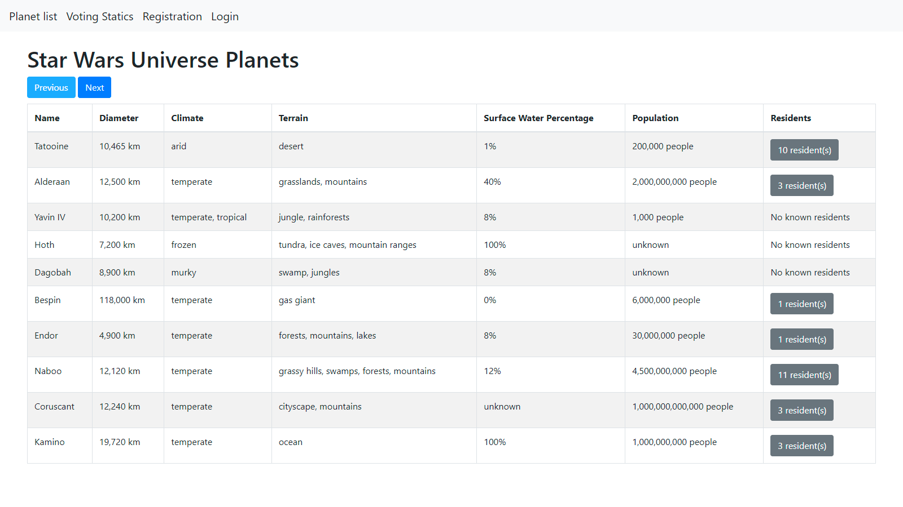

# API-Wars

A web application that shows data about the Star Wars universe, from [SWAPI](https://swapi.dev).

It can store visitor preferences with cookies, and handles user login with sessions.



### Description
1. The application uses a PostgreSQL database.
2. The opening page of the website shows the data of 10 planets.
3. The data is represented in a table which is fully responsive.
4. Clicking the `residents` button in the planet table, a modal is displayed, showing all the residents of the planet.
5. Data is loaded into the table without refreshing the page (with AJAX).
6. There is a simple user login system with a registration page (`/register`), a login page (`/login`), and a logout (`/logout`) link in the header.
7. If the user is logged in, display a button in each row with which the logged in user can vote on a planet. The votes are storied in a database.
8. There is a link in the header that opens a modal showing voting statistics based on the user votes saved in the database.

### Instruction:

To start:
```
python server.py
```

To install requirements:
```
pip install -r .\requirements.txt 
```
